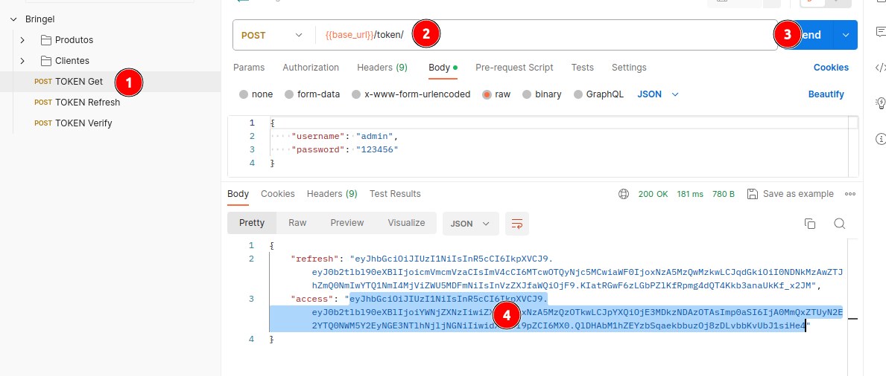

# API de Produtos para a loja Bringel Store

## Descrição do Projeto

O objetivo é construir uma API robusta para a gestão de produtos de um e-commerce, mas com um nível de complexidade elevado. Além de CRUD (Create, Read, Update, Delete), a API deverá fornecer recursos como filtragem avançada, paginação, relacionamento com outras entidades (como fornecedores e avaliações de clientes) e um algoritmo de recomendações de produtos.


### Detalhes do Projeto

- Modelo Avançado de Produto: Além dos campos básicos, implemente SKU, relacionamento com fornecedores, histórico de preço, e avaliações de clientes.
- Algoritmo de Recomendações: Implemente um algoritmo simples de recomendações de produtos com base na categoria ou tags.
- Autenticação e Autorização: Use OAuth2 com JWT. Implemente diferentes níveis de acesso (admin, usuário registrado, usuário anônimo).
Documentação: Use Swagger para documentação automática da API.
- Banco de Dados: PostgreSQL com suporte a transações e implementação de cache.
- Commits e CI/CD: Além do Conventional Commits, implemente um pipeline de CI/CD usando GitHub Actions ou similar.
- Logging: Implemente logs eficientes que capturem erros e atividades importantes na aplicação.
- Asynchronous Tasks: Utilize Celery para tarefas assíncronas (recálculo de avaliação média do produto após a avaliação do cliente, por exemplo)


## Tecnologias utilizadas


- [Docker](https://www.docker.com)
- [Docker Compose](https://docs.docker.com/compose/)
- [Python 3.11.0](https://www.python.org/)
- [Celery 5.3.6](https://pypi.org/project/celery/)
- [Redis 5.0.2](https://pypi.org/project/django-redis/)
- [Django Rest Framework](https://www.django-rest-framework.org/)
- [Imagem Docker Postgres 16.1](https://hub.docker.com/_/postgres)
- [Django Simple JWT](https://django-rest-framework-simplejwt.readthedocs.io/en/latest/)
- [Pytest Django](https://pytest-django.readthedocs.io/en/latest/)
- [Swagger](https://swagger.io/)


## Instalação

Clone do projeto:

```sh
$ git clone git@github.com:juniorari/bringel-store.git
```

Acessar a pasta do projeto:

```sh
$ cd bringel-store
```

Criar e subir os containers:

```sh
$ docker-compose up --build -d
```

OBS. Não é necessário a ativação do ambiente virtual (venv), pois tudo será executado dentro do container,

Após a criação dos containers, executar as migrations, e criar um superusuário.

Entrar no container:

```sh
$ docker exec -it bringel_app bash
```

Executar os seguintes comandos:

```sh
$ python manage.py createsuperuser --username admin --email email@email.com
    # (defina uma senha)
$ python manage.py makemigrations
$ python manage.py migrate
```

Crie alguns dados faker. OBS: o comando pode ser executado várias vezes, criando mais dados aleatórios.

```sh
$ python create_fakers.py
```


- O projeto está rodando em [http://localhost:8888/](http://localhost:8888/), com uma mensagem de boas vindas.

- A documentação do Swagger foi gerado em: [http://localhost:8888/swagger/](http://localhost:8888/swagger/)


- Para acessar o Painel admin: [http://localhost:8888/admin/](http://localhost:8888/admin/)


### Adicionando usuários

Para acessar os endpoints de usuários autenticados, é necessário criar ao menos um usuário admin (feito na etapa acima), e alternativamente outros usuários, dentro do Painel admin [http://localhost:8888/admin/](http://localhost:8888/admin/).


1. Insira o `username`
2. Informe uma senha
3.  Confirme a senha
4. Salvar usuário 

### Funcionalidades do projeto:

O projeto possui as seguintes características:


- CRUD `products`:

    * Criar um produto, obedecendo as validações do model, como a unicidade do `sku` (não pode cadastrar dois produtos com o mesmo `sku`)
    * Listagem de todos os producos, com paginação e a possibilidade de setar a quantidade de resgistros por página através do parâmetro `per_page`.
    * Busca avançada através dos parâmetros: `name`, `category`, `sku` e `supplier_id`
    * Buscar por um `id` específico.
    * Atualizar e deleter produtos
    * Histórico de preços
    * Criar uma avaliação de produto por cliente
    * Listagem das avaliação dos produtos, com as devidas validações e nota entre `1` e `5`


- CRUD `clients`:

    * Criar um cliente, obedecendo as validações do model, inclusive a validação do `cpf` e não permitindo a duplicação dos campos `username`, `cpf` e `email` na tabela.
    * Listagem de todos os clientes, com paginação e a possibilidade de setar a quantidade de resgistros por página através do parâmetro `per_page`.
    * Busca avançada através dos parâmetros: `name`, `username`, `email` e `cpf`
    * Buscar por um `id` específico.
    * Atualizar e deleter produtos
    * Histórico de preços
    * Listagem de avaliação de clientes
    * Criar uma avaliação de produto por cliente
    * Algoritmo de Recomendação de produtos por cliente. A recomendação gera uma lista com no máximo 10 produtos, baseado nas sugestões produtos feitas pelo Cliente, trazendo sempre das categorias que tiveram maiores pontuação.


### Rotas e permissões de acesso de clientes
---


|Método | URL/Rota |  | Permissão
|--- |--- | --- | --- |
| GET    | /client/ | Listar todos os clientes | Usuário logado ou anônimo   | 
| GET    | /client/list/{id}  | Lista um cliente | Usuário logado | 
| POST   | /client/create/  | Criar cliente | Usuário logado | 
| PUT    | /client/update/{id}  | Atualiza cliente | Usuário logado | 
| DELETE | /client/delete/{id}  | Apagar cliente |  Somente Admin | 
| GET    | /client/sugestion/{id}  | Recomendação de produtos | Usuário anônimo | 


### Rotas e permissões de acesso de produtos
---


|Método | URL/Rota |  | Permissão
|--- |--- | --- | --- |
| GET    | /product/ | Listar todos os produtos | Usuário logado ou anônimo   | 
| GET    | /product/list/{id}  | Lista um produto | Usuário logado | 
| POST   | /product/create/  | Criar produto | Usuário logado | 
| PUT    | /product/update/{id}  | Atualiza produto | Usuário logado | 
| DELETE | /product/delete/{id}  | Apagar produto |  Somente Admin | 
| GET    | /product/price-history/{id}  | Histórico de preço | Usuário anônimo | 


### Criando o token de usuário Autenticado

Foi disponibilizada uma Colletion do Postman para acesso às APIs [https://www.postman.com/dark-resonance-179389/workspace/bringel/request/2889430-6467698f-cf5b-4b4c-8153-b562bc5432b0](https://www.postman.com/dark-resonance-179389/workspace/bringel/request/2889430-6467698f-cf5b-4b4c-8153-b562bc5432b0)

Acesse o link e vá para o link para gerar o token de acesso, e copie o token gerado:




De posse do token acrescente no Header conforme a seguir:


Pronto, agora já tem acesso às rotas autenticadas.


### Teste de Stress

O projeto utiliza o `lucust` para executar o teste de stress.

```sh
$ locust -f client/tests/stress_test.py 
```

Acessar a url [http://0.0.0.0:8089/](http://0.0.0.0:8089/) para ver e acessar o teste

